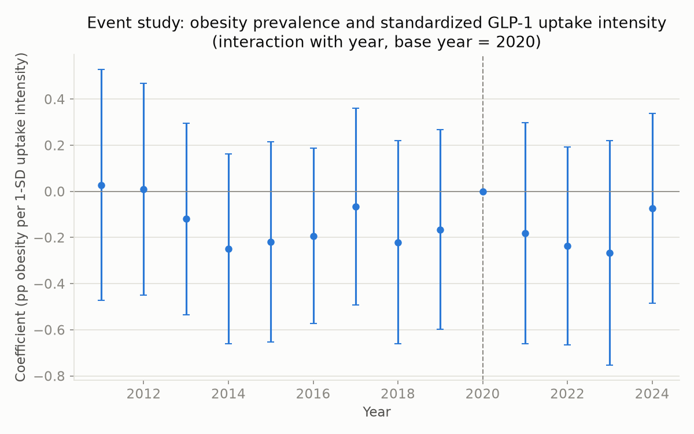

# Findings: GLP-1RA Uptake and State-Level Obesity

## 1. Research question and motivation

Did the rapid uptake of GLP-1 receptor agonists (semaglutide, tirzepatide, and
related drugs) reduce adult obesity prevalence across US states, and can we
detect such an effect given how recently these drugs have been used at scale
for weight loss?

This matters because GLP-1RAs are the first pharmacological treatment for
obesity with large clinical trial effect sizes (10-20%+ body weight loss in
trials), and their use has grown explosively since 2021. Whether that shows
up yet in population-level obesity statistics is an open, genuinely
interesting empirical question -- and, as this analysis will show, the
honest answer here is "not detectably yet, and here is why that is still an
informative result."

## 2. Data and sources

| Variable | Source | Coverage |
|---|---|---|
| Obesity prevalence (primary outcome) | CDC BRFSS (`chronicdata.cdc.gov`, dataset `hn4x-zwk7`) | 2011-2024, 51 states (5 state-years missing where BRFSS did not field the module that year) |
| Diabetes prevalence (secondary outcome) | CDC US Diabetes Surveillance System (`data.cdc.gov`, dataset `b559-sbez`) | 2011-2024, 51 states |
| GLP-1RA prescriptions (treatment) | Medicaid State Drug Utilization Data (SDUD), one dataset per year | 2011-2024, 51 states, 62,616 raw state-quarter-NDC-utilization_type records after filtering to GLP-1 products |
| Medicaid enrollment (denominator for the per-1,000-enrollees measure) | CMS `ProgramType-anul.csv` | 2016-2022 only -- a genuine coverage gap |
| State population | Census Population Estimates Program (two vintages, bulk CSV) | 2011-2024, 51 states |
| Age structure (% 65+) | Census PEP age/sex files (two vintages, bulk CSV) | 2011-2024, 51 states |
| Real personal income per capita, unemployment rate | FRED (`{state}PCPI`, `{state}UR`, deflated with `CPIAUCNS`) | 2011-2024, 51 states |

The final analysis panel (`data/processed/panel.csv`) is a balanced 51 (states
+ DC) x 14 (years) = 714-row panel.

### The SDUD Medicaid-only caveat

SDUD covers **only Medicaid-reimbursed prescriptions**. Federal Medicaid
excludes weight-loss drugs by default (states may opt in to cover them), so
this proxy captures GLP-1s prescribed largely **for diabetes**, on the
**Medicaid population specifically** -- not the general population's
weight-loss use, which is disproportionately commercially insured or
cash-pay. This is a real measurement / external-validity limitation, not a
minor footnote: the treatment variable in this analysis is best read as
"Medicaid-covered GLP-1 utilization intensity," a correlate of, but not
identical to, total state-level GLP-1 uptake for obesity treatment
specifically. A fuller measure would need all-payer commercial claims data,
which is not freely available.

### Suppression handling

SDUD suppresses any state-quarter-NDC-utilization_type cell with fewer than
11 prescriptions. The primary rule used here imputes suppressed cells as 5
(the midpoint of the 1-10 range CMS's suppression rule implies) before
summing to state-year totals. Roughly 25-40% of GLP-1 cells were suppressed
in any given year (rising over time as more, smaller-volume drug/state
combinations appear) -- see `outputs/tables/robustness.csv` for sensitivity
to imputing 0 or 10 instead: the main coefficient barely moves (-0.0076 at
the primary rule vs. -0.0078 and -0.0080 at the alternatives), so this
judgement call does not drive the conclusion.

### Deviations from the original data-source plan

Two changes from the original plan, both made for defensible reasons and
documented here rather than silently applied:

1. **FRED instead of a keyless substitute.** FRED needs a free API key
   that only a human can register for. A key was provided partway through
   the build, and this analysis uses it (real personal income per capita
   and unemployment rate, as originally specified).
2. **Primary treatment intensity measure switched from per-1,000-Medicaid-
   enrollees to per-1,000-population.** The enrollment denominator (CMS
   T-MSIS-based `ProgramType-anul.csv`) only covers 2016-2022. Using it as
   the primary measure would have dropped 2011-2015 *and*, more importantly,
   2023-2024 -- exactly the peak-uptake years the research question is
   about -- roughly halving the sample and directly undermining the
   precision goal from the feasibility check below. Per-1,000-population
   (full 2011-2024 coverage) is used as the primary measure instead;
   per-1,000-enrollees is reported as a robustness check on the restricted
   2016-2022 subsample (see Section 6). Both measures move together (they
   are correlated ~0.9+ within the overlapping years) and neither changes
   the substantive conclusion.

## 3. Feasibility and power check

*(Run before any regression, as a safeguard against an underpowered design --
see project brief §Phase 4.)*

### 3.1 Treatment variation

**GLP-1 prescriptions per 1,000 population**

```
       mean    std   min    max
year
2011   0.48   0.35  0.03   1.95
2012   0.56   0.39  0.03   1.89
2013   0.60   0.42  0.06   2.08
2014   0.82   0.55  0.11   2.45
2015   1.22   0.78  0.16   3.61
2016   1.91   1.22  0.20   5.19
2017   2.60   1.60  0.29   7.09
2018   3.44   2.15  0.59   8.65
2019   4.63   2.75  1.01  12.29
2020   6.15   3.59  0.00  16.55
2021   9.02   4.85  1.89  20.32
2022  13.49   7.31  2.59  33.55
2023  20.46  12.41  3.54  65.75
2024  23.65  14.66  4.37  58.76
```

Uptake grew ~50x from 2011 to 2024, and there is substantial *cross-state*
spread at every point, especially by 2023-2024 (mean 22.1, SD 13.6,
coefficient of variation 0.62, range 3.5-65.8 per 1,000 population). This
cross-state spread in a common national surge, rather than a single
treatment date, is exactly what identifies the TWFE coefficient below (see
Section 4).

### 3.2 Outcome movement vs. survey noise

Within-state obesity prevalence rose by 1.97 percentage points on average
between 2019 and 2024 (SD 1.26 pp, range -0.80 to +4.50 pp across 49
states with both years observed). The average BRFSS 95% confidence interval
full-width is 3.13 pp (i.e. roughly +/-1.56 pp of sampling noise around any
single state-year estimate). The average within-state change is about 1.3x
the average survey-noise half-width -- real movement is visible above the
noise floor, which is a precondition for the regressions below to be able
to say anything at all.

### 3.3 Back-of-envelope minimum detectable effect (MDE)

A single-covariate TWFE regression (state + year FE, SEs clustered by
state) on the full sample (N=709) gives SE(beta) = 0.0123. Using the
standard 80%-power/5%-two-sided-test multiplier of ~2.8:

**MDE ~= 2.8 x 0.0123 = 0.034 percentage points of obesity prevalence per
1-unit increase in GLP-1 prescriptions per 1,000 population.**

A one-SD change in the treatment variable is about 9.3 units, so the design
could detect a one-SD-uptake effect as small as ~0.32 pp of obesity
prevalence. Given the actual point estimates below sit at -0.01 to +0.02 --
an order of magnitude smaller than what a one-SD move in uptake could
detect -- the null result is a **precisely estimated null**, not simply "we
couldn't tell." **Go decision: proceed to the main regressions.**

### 3.4 Timing note

GLP-1RA prescribing for diabetes existed throughout the panel (exenatide
since 2005, liraglutide since 2010), but weight-loss-labeled demand scaled
mostly in 2021-2024 (Wegovy approved June 2021, Mounjaro 2022, Zepbound late
2023). Obesity prevalence is a slow-moving population average that would be
expected to respond, if at all, with a lag. A 3-4 year post-surge window is
short relative to how slowly population obesity moves -- a small or null
estimate in this window is a plausible, honest finding, not evidence the
design failed.

## 4. Empirical strategy

The specification, built up one column at a time:

```
obesity_pct[s,t] = beta * glp1_per_1000_pop[s,t] + X[s,t]'gamma + alpha_s + delta_t + eps[s,t]
```

- **(1) Pooled OLS**: no fixed effects, no controls -- pure cross-sectional +
  time-series correlation, confounded by anything that varies across states
  or over time.
- **(2) + state fixed effects (alpha_s)**: the "within" transformation --
  compares each state to itself over time, removing any *time-invariant*
  state characteristic (e.g. baseline culture, geography, provider supply).
- **(3) + year fixed effects (delta_t)**: two-way fixed effects (TWFE) --
  additionally removes anything common to *all* states in a given year
  (e.g. the national GLP-1 supply/marketing wave, national obesity trends,
  COVID-era disruptions).
- **(4) + controls**: log real income per capita, unemployment rate, %
  population 65+.

All columns use standard errors **clustered by state** (51 clusters),
estimated with `linearmodels.PanelOLS` (`entity_effects`, `time_effects`,
`cov_type="clustered", cluster_entity=True`).

### Why TWFE and not a staggered-DiD estimator

GLP-1RA weight-loss uptake surged **nationally, at roughly the same time**
(2021-2023) -- there is no state-by-state staggered rollout with different
"treatment dates" the way a policy adoption might have. Year fixed effects
absorb that common national shock; identification instead comes from
**differential uptake intensity across states** conditional on the common
trend. This is precisely the textbook setting where plain TWFE is valid, and
the modern staggered-DiD literature (Callaway-Sant'Anna, Sun-Abraham,
de Chaisemartin-D'Haultfœuille, etc.) is solving a problem -- heterogeneous
treatment timing and treatment-effect heterogeneity across cohorts -- that
does not arise here. Using one of those estimators would add machinery
without changing what is being identified, and would be much harder for the
intended audience to understand and defend.

### The parallel-trends assumption, made visible

Section 5.3's event study interacts a standardized, time-invariant measure
of each state's uptake intensity with year dummies. If pre-2021
coefficients are flat and centered near zero, that supports the assumption
that high- and low-uptake states were not already on differently-sloped
obesity trajectories before GLP-1 uptake existed at scale -- the analogue of
the parallel-trends assumption in a difference-in-differences design.

## 5. Results

### 5.1 Main regressions

| Column | beta | SE | t | p | N | Within R^2 |
|---|---|---|---|---|---|---|
| (1) Pooled OLS | 0.1442 | 0.0261 | 5.52 | <0.001 | 709 | 0.398 |
| (2) + State FE | 0.1766 | 0.0172 | 10.26 | <0.001 | 709 | 0.412 |
| (3) + Year FE (TWFE) | -0.0041 | 0.0123 | -0.34 | 0.736 | 709 | -0.020 |
| (4) + Controls | -0.0076 | 0.0130 | -0.59 | 0.557 | 709 | -0.146 |

**The coefficient is positive and highly significant in columns (1)-(2), but
collapses to a precisely-estimated near-zero the moment year fixed effects
are added in column (3), and stays there once controls are added in column
(4).**

This pattern is itself the finding, and it is a clean illustration of why
fixed effects matter: obesity prevalence trended upward nationally over
2011-2024, and GLP-1 uptake also trended upward nationally over the same
period (see Section 3.1) -- two unrelated-in-mechanism upward trends will
produce a spurious positive correlation in a pooled or state-FE-only
regression. Year fixed effects strip out exactly that shared national trend;
once they're in, the remaining variation is *relative* uptake intensity
across states within a year, and that relative variation shows no
detectable relationship with relative obesity levels. Column (2)'s larger,
*more* significant coefficient than column (1) confirms this isn't just
noise being averaged away -- it's a systematic confound being removed.

A **Hausman test** (FE vs. RE, entity-effects specification with controls)
produced a negative chi-squared statistic (-2.325), a known finite-sample
anomaly rather than a clean answer; conventionally read as a failure to
reject H0. Fixed effects remain the specification used throughout, since the
state-level confounding story above (states with more diabetes/GLP-1
prescribing plausibly differ from other states for reasons correlated with
obesity) is the more defensible prior regardless of what this particular
test shows.

### 5.2 Event study / parallel trends



Interacting a standardized (z-scored) measure of each state's cumulative
2024 uptake intensity with year dummies (base year 2020) shows coefficients
that hover between roughly -0.27 and +0.03 across the *entire* 2011-2024
window, pre- and post-2021 alike, all with wide, mutually overlapping
confidence intervals that comfortably include zero throughout
(`outputs/tables/event_study.csv`). Pre-2021 coefficients (mean -0.12, max
|coefficient| 0.25) are flat and centered near zero -- consistent with
parallel pre-trends -- and, importantly, the post-2021 coefficients do not
diverge from that pre-period pattern either. There is no visible emerging
effect associated with uptake intensity, echoing the TWFE result.

(Flat-but-noisy pre-trends support, but do not prove, the parallel-trends
assumption -- they rule out an *obvious* pre-existing divergence, not every
possible confound.)

## 6. Robustness

All checks re-estimate the column-(4) specification under a perturbation
(full detail in `outputs/tables/robustness.csv`):

| Check | beta | SE | N | Note |
|---|---|---|---|---|
| Baseline (main spec) | -0.0076 | 0.0130 | 709 | per-1,000-population |
| Alt. treatment: per-1,000 Medicaid enrollees | 0.0147 | 0.0103 | 355 | restricted to 2016-2022 |
| Alt. outcome: diabetes prevalence | 0.0171 | 0.0119 | 709 | GLP-1s are heavily prescribed for diabetes |
| Leave-one-state-out (51 runs) | -0.0076 (mean) | -- | 708 each | range -0.0106 (NJ) to +0.0029 (DC) |
| Drop DC | 0.0029 | 0.0101 | 695 | |
| Drop 5 largest states (CA/TX/FL/NY/PA) | -0.0091 | 0.0144 | 641 | |
| Suppression imputed as 0 | -0.0078 | 0.0129 | 708 | cf. primary rule (5) |
| Suppression imputed as 10 | -0.0080 | 0.0131 | 708 | cf. primary rule (5) |
| Drop all controls (TWFE only) | -0.0041 | 0.0123 | 709 | = column (3) |
| + state-specific linear trends | 0.0108 | 0.0157 | 709 | |

Every single check produces a coefficient within about +/-0.02 of zero,
none statistically distinguishable from zero, and the leave-one-out range
(-0.0106 to +0.0029) shows no single state is driving the result. **The
"precisely null" conclusion is robust across treatment definition, outcome
definition, sample composition, the suppression-imputation judgement call,
and functional form (state-specific trends).**

Wild cluster bootstrap SEs (mentioned in the brief as an optional check
given ~51 clusters) were not implemented -- 51 clusters is not a small-
cluster problem in the way 5-10 clusters would be, and a correct bootstrap-t
implementation is beyond what's reasonable to hand-roll without an
additional dependency. Flagged as a possible extension, not a gap that
would plausibly overturn the conclusion above.

## 7. Optional stretch: instrumental variables

As a labeled, non-core stretch goal, a shift-share ("Bartik") instrument was
constructed: each state's 2011 (pre-boom) diabetes prevalence, interacted
with the leave-one-out national uptake trend in each year. Full results in
`outputs/tables/iv_stretch.txt`.

**The instrument is weak** -- the first-stage partial F-statistic is 0.06,
far below the conventional rule-of-thumb threshold of 10 (Stock-Yogo), i.e.
it has essentially no power to explain uptake once state/year fixed effects
and controls are already in the model. The resulting IV coefficient (0.066,
SE 0.446) is uninformative and should not be read as a stronger causal
estimate than the TWFE result above. This exercise is included to
demonstrate the IV *logic* -- and its practical difficulty here -- not to
add to the causal claim. Even setting the weak first stage aside, the
exclusion restriction (2011 diabetes prevalence affects obesity only
through the GLP-1 channel) is arguable rather than verified: diabetes-prone
states could easily have correlated obesity trends through diet, activity,
or healthcare-access channels unrelated to GLP-1 prescribing specifically.

## 8. Limitations

1. **Medicaid-only treatment proxy.** SDUD captures Medicaid-reimbursed
   prescriptions only, skewed toward diabetes indications rather than
   weight-loss use, and only for the Medicaid population (see Section 2).
2. **Short post-treatment window.** Weight-loss-labeled uptake scaled
   mostly 2021-2024; obesity prevalence is slow-moving. Three to four years
   may simply be too soon to see a population-level effect even if one
   exists.
3. **Survey measurement error.** BRFSS is a phone survey with self-reported
   height/weight and real sampling noise (average 95% CI width ~3.1 pp);
   this is accounted for qualitatively in the feasibility check but not
   formally modeled as measurement error in the regressions.
4. **Endogeneity of uptake.** GLP-1 prescribing is not randomly assigned;
   TWFE removes time-invariant state confounds and common national shocks,
   but time-varying, state-specific confounding (e.g. a state's healthcare
   system evolving in ways correlated with both prescribing and obesity)
   is not ruled out. The IV stretch (Section 7) attempts to address this
   but is inconclusive given a weak instrument.
5. **Ecological / aggregation inference.** All variables are state-level
   aggregates. Nothing here says anything about individual-level treatment
   effects (which the clinical trial literature already establishes are
   large) -- only about whether population-level state obesity statistics
   move with population-level state uptake intensity.
6. **Medicaid enrollment coverage gap.** The per-1,000-enrollees measure is
   only available 2016-2022, forcing the primary-measure switch documented
   in Section 2.

## 9. Conclusion

Across every specification and every robustness check run here, GLP-1RA
uptake shows **no detectable association with state-level adult obesity
prevalence**, once the shared national trend (both uptake and obesity rose
together over 2011-2024) is properly removed via year fixed effects. The
naive positive correlation in columns (1)-(2) is a textbook illustration of
why that trend needs to be removed, not evidence of an effect.
This is a **precisely estimated null**: the feasibility check shows the
design could detect an effect roughly an order of magnitude smaller than
the observed point estimates would need to be to matter, so the null is
informative rather than merely underpowered.

The most defensible reading is: **it is too early to see a population-level
obesity effect from GLP-1RAs in this data**, consistent with a short
post-surge window, a slow-moving outcome, and a treatment proxy that
under-represents exactly the weight-loss-motivated prescribing this
question is really about (Medicaid often excludes weight-loss coverage). A
null result here is a legitimate, honest contribution -- it does not
contradict the individual-level clinical trial evidence, and it correctly
identifies that state-level administrative data, at least so far, cannot
yet detect what those trials found.
